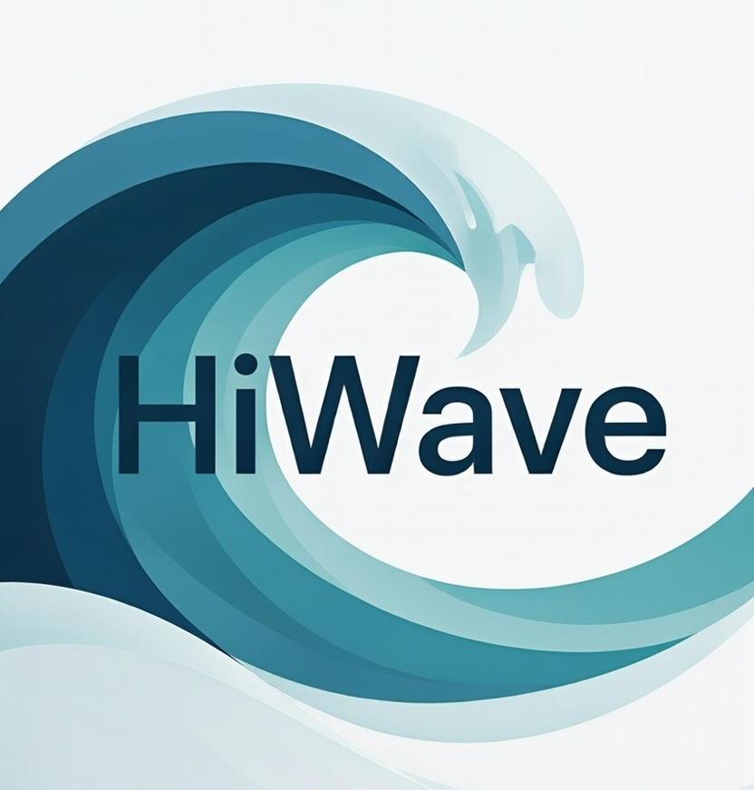

<p align="center">
  
</p>

<h1 align="center">HiWave</h1>

<p align="center">
  <strong>Focus. Flow. Freedom.</strong><br>
  A privacy-first browser that helps you close tabs, not open more.
</p>

<p align="center">
  <a href="#features">Features</a> •
  <a href="#download">Download</a> •
  <a href="#philosophy">Philosophy</a> •
  <a href="#contributing">Contributing</a> •
  <a href="#support">Support</a>
</p>

<p align="center">
  
  
  
</p>

---

## The Problem

Modern browsers are designed to keep you browsing. More tabs, more tracking, more data vultures, more history, more extensions, more complexity. The result? Dozens of open tabs you'll "get to eventually," fractured attention, and digital clutter that drains your focus and steals your privacy.

## The Solution

**HiWave** flips the script. We built a browser that actively helps you browse *less* — in a good way.

- **The Shelf** — Tabs you're not using decay and fade away, so you don't have to manually manage them
- **Workspaces** — Separate contexts (work, personal, research) that don't bleed into each other
- **Built-in Privacy** — Ad and tracker blocking with no extensions needed
- **Three Modes** — Choose your level of automation: do it yourself, get suggestions, or let Zen handle it

---

## Features

### 🗂️ The Shelf
Park tabs for later without leaving them open. Shelved items show their age, naturally fading so forgotten pages don't haunt you forever.

### ⏰ Tab Decay
Unused tabs gradually fade, giving you visual cues about what's actually important. In Zen mode, old tabs automatically shelve themselves.

### 🛡️ Flow Shield
Native ad and tracker blocking powered by Brave's engine. No extension required. Just fast, private browsing out of the box.

### 🔐 Flow Vault
Built-in password manager with AES-256 encryption. Your credentials stay local and secure.

### 🗃️ Workspaces
Separate your browsing contexts completely. Work tabs stay in Work, personal stays in Personal. Switch instantly with keyboard shortcuts.

### ⌨️ Keyboard First
Power users rejoice. Everything is accessible via keyboard:
- `Ctrl+K` — Command palette (search anything)
- `Ctrl+Shift+S` — Shelve current tab
- `Ctrl+B` — Toggle sidebar
- `Ctrl+1-9` — Jump to specific tab

### 🎛️ Three Modes
| Mode | For | What It Does |
|------|-----|--------------|
| **Essentials** | Control freaks | Manual everything |
| **Balanced** | Most people | Smart suggestions |
| **Zen** | Trust the system | Full automation |

---

## Download

### Latest Release

| Platform | Download |
|----------|----------|
| Windows (x64) | [zen-windows-x64.zip](#) |
| macOS (Intel) | [zen-macos-intel.dmg](#) |
| macOS (Apple Silicon) | [zen-macos-arm64.dmg](#) |
| Linux (x64) | [zen-linux-x64.AppImage](#) |

> **Note:** Zen is currently in alpha. Expect some rough edges!

### Build from Source

```bash
# Prerequisites: Rust 1.75+, platform dependencies (see CONTRIBUTING.md)

git clone https://github.com/YOUR_USERNAME/pureflow.git
cd pureflow
cargo run -p pureflow-app
```

---

## Philosophy

### Attention over Tabs
We don't measure success by how many tabs you open. We measure it by how focused you stay.

### Simplicity over Extensibility  
No extension ecosystem. Features are built-in, tested, and integrated. One browser, one experience.

### Privacy by Default
Tracking protection isn't an add-on, it's foundational. We don't collect your data. Period.

### Modern Web Only
We target post-2020 web standards. No legacy cruft, no compatibility hacks for sites that should've been updated years ago.

### Opinionated but Respectful
We have strong opinions about how browsing should work, but we offer three modes so you can choose your level of buy-in.

---

## Screenshots

<p align="center">
  <em>Coming soon — the UI is still evolving!</em>
</p>

---

## Roadmap

### Now (Alpha)
- ✅ Core browsing (tabs, navigation, address bar)
- ✅ The Shelf with decay visualization
- ✅ Workspaces
- ✅ Flow Shield (ad blocking)
- ✅ Flow Vault (password manager)
- ✅ Command palette
- 🔄 Settings page
- 🔄 Bidirectional IPC sync

### Next (Beta)
- [ ] Find in Page (Ctrl+F)
- [ ] Bookmarks
- [ ] History
- [ ] Downloads manager
- [ ] Context menus
- [ ] Import from Chrome/Firefox

### Future
- [ ] Zen Sync (cross-device)
- [ ] Reader Mode
- [ ] Tab audio indicators
- [ ] Themes (light mode)
- [ ] Mobile companion

---

## Contributing

We welcome contributions! See [CONTRIBUTING.md](CONTRIBUTING.md) for:
- Development setup
- Code style guidelines
- Pull request process
- Areas where we need help

**Quick Start:**
```bash
cargo test --workspace        # Run tests
cargo fmt                     # Format code
cargo clippy                  # Lint
```

---

## Support Zen's Development

HiWave is **free and open source**. No ads, no tracking, no data selling.

If Zen helps you focus better, consider supporting its development:

<p align="center">
  <a href="https://github.com/sponsors/YOUR_USERNAME">
    
  </a>
  <a href="https://ko-fi.com/YOUR_USERNAME">
    
  </a>
  <a href="https://opencollective.com/pureflow">
    
  </a>
</p>

Your support helps cover:
- Development time
- Infrastructure costs
- Future features like Zen Sync

---

## Architecture

Zen uses a **multi-WebView architecture**:

```
┌─────────────────────────────────────────┐
│  Chrome WebView (Browser UI)            │
│  Tabs • Address Bar • Sidebar           │
├─────────────────────────────────────────┤
│                                         │
│  Content WebView (Web Pages)            │
│                                         │
└─────────────────────────────────────────┘
```

Built with:
- **Rust** — Core logic, memory safety
- **WRY/Tao** — Cross-platform WebView
- **Brave's adblock-rust** — Ad blocking engine
- **Vanilla JS** — No framework bloat in the UI

---

## License

HiWave is licensed under the [Mozilla Public License 2.0](LICENSE).

This means:
- ✅ Free to use, modify, and distribute
- ✅ Source code is open
- ✅ You can build commercial products with it
- ⚠️ Changes to Zen's files must be shared under MPL-2.0

---

## FAQ

**Q: Why not just use Firefox/Brave/Arc?**  
A: They're great browsers! But none of them have The Shelf, tab decay, or our specific philosophy around reducing cognitive load. Zen is for people who want a browser that actively helps them browse *less*.

**Q: Is this production-ready?**  
A: Not yet. We're in alpha. Use it as a secondary browser while we iron out the kinks.

**Q: Will there be a mobile version?**  
A: Eventually! Desktop is the priority for now.

**Q: How do you make money?**  
A: We don't yet. Future plans include optional Zen Sync (paid) and possibly search partnerships. We will never sell your data or show ads.

---

<p align="center">
  <strong>Built with 💜 for people who want to focus.</strong>
</p>

<p align="center">
  <a href="https://zenbrowser.io">Website</a> •
  <a href="https://github.com/YOUR_USERNAME/pureflow">GitHub</a> •
  <a href="https://twitter.com/zenbrowser">Twitter</a>
</p>
