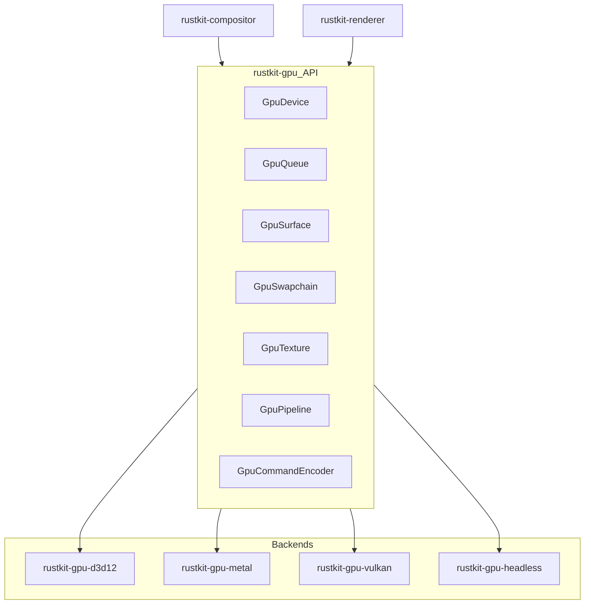
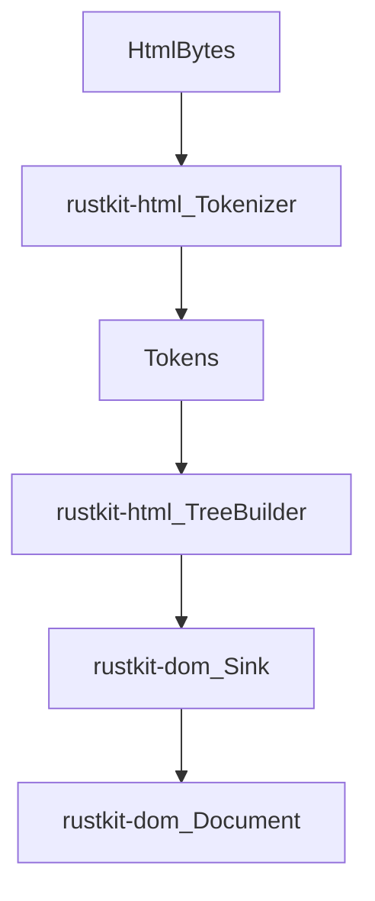

# Bravo 5 & 6: Detailed Plan of Attack (wgpu + html5ever Full Cutover)

## Context (what we are replacing)

- **Bravo 5 (wgpu)** is currently directly depended on by:
  - `[crates/rustkit-compositor/src/lib.rs](P:/petes_code/ClaudeCode/hiwave-windows/crates/rustkit-compositor/src/lib.rs)` (device/queue/instance/surface/swapchain)
  - `[crates/rustkit-renderer/src/lib.rs](P:/petes_code/ClaudeCode/hiwave-windows/crates/rustkit-renderer/src/lib.rs)` (pipelines, buffers, textures, shader modules)
  - `[crates/rustkit-image/Cargo.toml](P:/petes_code/ClaudeCode/hiwave-windows/crates/rustkit-image/Cargo.toml)` (wgpu used for texture upload support)

- **Bravo 6 (html5ever)** is currently used by:
  - `[crates/rustkit-dom/src/lib.rs](P:/petes_code/ClaudeCode/hiwave-windows/crates/rustkit-dom/src/lib.rs)` via `html5ever::parse_document` + `markup5ever_rcdom::RcDom`
  - `[crates/rustkit-dom/Cargo.toml](P:/petes_code/ClaudeCode/hiwave-windows/crates/rustkit-dom/Cargo.toml)` depends on `html5ever` and `markup5ever_rcdom`

## Constraints chosen

- **Target**: **cross-platform** (Windows/macOS/Linux builds for engine crates)
- **Independence**: **full cutover** (no `wgpu` / no `html5ever` / no `markup5ever_rcdom` in the build graph after these phases)

---

## Bravo 5: `wgpu` → `rustkit-gpu` (cross-platform, full cutover)

### High-level approach

1. Introduce a **RustKit-owned graphics abstraction** (`rustkit-gpu`) tailored to *our actual needs* (swapchain + 2 pipelines + texture upload + uniform updates).
2. Provide **backend crates** per platform that implement the abstraction:
   - Windows: D3D12
   - macOS: Metal
   - Linux: Vulkan
3. Provide a **headless backend** for tests and CI that can run without a window.
4. Migrate `rustkit-compositor` and `rustkit-renderer` to use `rustkit-gpu`.
5. Remove `wgpu` from all crates and the workspace dependency graph.

### Architecture

### Surface area definition (minimum needed to match current renderer)

We deliberately match what `rustkit-renderer` uses today:

- **Device/Queue**: create buffers, textures, pipelines; submit command buffers
- **Surface/Swapchain**: per-view `get_current_frame()` + `present()`
- **Render passes**:
  - `begin_render_pass(color_attachment)`
  - set pipeline
  - set bind groups / uniforms
  - set vertex/index buffers
  - draw indexed
- **Resources**:
  - `Buffer` (vertex/index/uniform)
  - `Texture2D` (RGBA8) + `TextureView`
  - `Sampler`
- **Pipeline**:
  - `ColorPipeline` (solid color quad)
  - `TexturePipeline` (sampled texture for glyphs/images)

### Step-by-step plan

#### B5.0: Inventory and “API contract” lock
- Extract the required API by scanning only these call sites:
  - `[crates/rustkit-compositor/src/lib.rs](P:/petes_code/ClaudeCode/hiwave-windows/crates/rustkit-compositor/src/lib.rs)`
  - `[crates/rustkit-renderer/src/lib.rs](P:/petes_code/ClaudeCode/hiwave-windows/crates/rustkit-renderer/src/lib.rs)`
  - `[crates/rustkit-renderer/src/pipeline.rs](P:/petes_code/ClaudeCode/hiwave-windows/crates/rustkit-renderer/src/pipeline.rs)`
  - `[crates/rustkit-renderer/src/shaders/*](P:/petes_code/ClaudeCode/hiwave-windows/crates/rustkit-renderer/src/shaders)`
- Produce a small “contract document” (`docs/BRAVO5-RUSTKIT-GPU-API.md`) that lists required calls and guarantees.

Acceptance:
- We can write `rustkit-gpu` traits/types that cover all current usage without adding “generic wgpu clone” surface.

#### B5.1: Create `rustkit-gpu` core crate
Create new crates:
- `crates/rustkit-gpu` (public API)
- `crates/rustkit-gpu-headless` (tests/offscreen)
- `crates/rustkit-gpu-d3d12`, `crates/rustkit-gpu-metal`, `crates/rustkit-gpu-vulkan`

Key design decisions:
- **Handle-based API**: opaque IDs for buffers/textures to keep backends independent.
- **Feature flags**:
  - `backend-d3d12`, `backend-metal`, `backend-vulkan`, `backend-headless`
  - default backend selection per target OS
- **No shader translation dependency**: use **native shader source per backend**.

Deliverables:
- `GpuContext::new()` and `GpuSurface::create_for_native_window(...)` (platform-specific)
- `Swapchain::acquire()` returns `Frame { texture_view, present() }`

#### B5.2: Implement Headless backend first (unblocks tests)
- Provide an offscreen `FrameBuffer` texture and a minimal command encoder that can:
  - clear
  - draw indexed for the two pipelines
- Output is a CPU-side RGBA buffer for golden testing.

Acceptance:
- `rustkit-renderer` can run in a unit test and produce deterministic pixel buffers.

#### B5.3: Implement platform backends (incremental but compiling on all targets)
- **Windows (D3D12)**: implement swapchain, render target views, pipeline state objects.
  - Use existing `windows` crate patterns already present in the repo.
- **macOS (Metal)**: implement CAMetalLayer swapchain + render pipelines.
- **Linux (Vulkan)**: implement surface swapchain + render pipelines.

Pragmatic staging (still “full cutover”):
- Stage 1: backend crates compile with `todo!()`/"Unsupported" runtime errors, but headless tests pass.
- Stage 2: implement each backend enough to render the two pipelines.

Acceptance:
- Engine crates compile on Windows/macOS/Linux.
- At least one real GPU backend (Windows) renders a visible page with solid colors and textures.

#### B5.4: Migrate `rustkit-compositor` to `rustkit-gpu`
- Replace `wgpu::Instance/Adapter/Device/Queue/Surface` with `rustkit_gpu::{GpuContext, GpuDevice, GpuSurface, Swapchain}`.
- Replace per-view `wgpu::SurfaceConfiguration` with `SwapchainConfig`.
- Keep current invariants:
  - per-view swapchain
  - resize correctness

Acceptance:
- Existing multi-view surface management continues to work.

#### B5.5: Migrate `rustkit-renderer` to `rustkit-gpu`
- Replace all `wgpu::*` types with `rustkit_gpu::*` handles.
- Replace shader loading:
  - keep existing WGSL files for reference
  - add per-backend shader sources:
    - `shaders/color.hlsl`, `shaders/texture.hlsl`
    - `shaders/color.msl`, `shaders/texture.msl`
    - `shaders/color.spv`, `shaders/texture.spv` (or GLSL compiled in-repo)
- Replace buffer creation helpers (`DeviceExt`) with explicit upload APIs.
- Ensure `TextureCache::get_or_create` still supports RGBA uploads.

Acceptance:
- Renderer draws at least:
  - solid rects
  - textured quads (images)
  - glyph atlas textures (text)

#### B5.6: Remove `wgpu` from the entire workspace
- Remove `wgpu` dependencies in:
  - `rustkit-compositor`
  - `rustkit-renderer`
  - `rustkit-image`
- If `rustkit-image` is only using `wgpu` for "GPU texture upload", move that responsibility to `rustkit-renderer`/`rustkit-gpu` (preferred).

Acceptance:
- `cargo tree` shows **no `wgpu`**.

#### B5.7: Test strategy
- **Unit tests**:
  - `rustkit-gpu-headless` golden tests for the two pipelines.
- **Integration**:
  - `rustkit-renderer` renders a deterministic `DisplayList` to an offscreen buffer.
- **Manual**:
  - existing HiWave smoke app draws a few pages and screenshots match.

---

## Bravo 6: `html5ever` → `rustkit-html` (cross-platform, full cutover)

### High-level approach

1. Create `crates/rustkit-html` implementing:
   - tokenizer
   - tree builder
   - a small DOM-sink interface
2. Replace `Document::parse_html` to use `rustkit-html` and directly build `rustkit-dom` nodes.
3. Remove `html5ever` and `markup5ever_rcdom` dependencies.

### Architecture

### Step-by-step plan

#### B6.0: Define the DOM sink contract
- Add a small trait in `rustkit-html`:
  - `start_element(name, attrs)`
  - `end_element(name)`
  - `text(data)`
  - `comment(data)`
  - `doctype(name, public_id, system_id)`
- Implement the sink in `rustkit-dom` to build `Node`/`Document` directly.

Acceptance:
- `rustkit-html` can be used without depending on `rustkit-dom` (no circular deps).

#### B6.1: Implement tokenizer (HTML5-ish)
Minimum required token types:
- Doctype
- StartTag(name, attrs, self_closing)
- EndTag(name)
- Comment
- Character
- EOF

Must support these parsing modes:
- Data
- RCDATA (textarea/title)
- RAWTEXT (style)
- ScriptData (script)

Also implement:
- attribute parsing with quoting rules
- basic entity decoding (at least `&lt;`, `&gt;`, `&amp;`, `&quot;`, `&apos;`)

Acceptance:
- Tokenizer unit tests for tricky inputs.

#### B6.2: Implement tree builder (core rules + recovery)
Implement a pragmatic subset of the HTML5 tree builder sufficient for common pages:
- implicit html/head/body insertion
- void elements (`img`, `br`, `meta`, etc.)
- foster parenting for tables (minimal)
- basic adoption agency algorithm for formatting elements (minimal but functional)

Acceptance:
- Parse common documents into a stable DOM tree.

#### B6.3: Integrate into `rustkit-dom`
- Replace `Document::parse_html` in `[crates/rustkit-dom/src/lib.rs](P:/petes_code/ClaudeCode/hiwave-windows/crates/rustkit-dom/src/lib.rs)`:
  - remove `html5ever::parse_document` usage
  - call `rustkit_html::parse(html_bytes, sink)`
- Remove conversion code that depends on `RcDom`.

Acceptance:
- DOM construction no longer depends on `RcDom`.

#### B6.4: Remove dependencies
- Remove `html5ever` and `markup5ever_rcdom` from `[crates/rustkit-dom/Cargo.toml](P:/petes_code/ClaudeCode/hiwave-windows/crates/rustkit-dom/Cargo.toml)`.
- Ensure `cargo tree` shows no `html5ever` nor `markup5ever_rcdom`.

#### B6.5: Test strategy
- Add a parser test suite:
  - `crates/rustkit-html/tests/parser_cases/*.html`
  - expected serialized DOM output (custom serializer)
- Add integration tests in `rustkit-dom`:
  - verify node counts, tag nesting, attribute normalization

Acceptance:
- Parser survives malformed HTML and still returns a usable DOM.

---

## Cross-phase coordination (Bravo 5 + 6)

- Update `[P:/petes_code/ClaudeCode/hiwave-windows/docs/RUSTKIT-ROADMAP.md](P:/petes_code/ClaudeCode/hiwave-windows/docs/RUSTKIT-ROADMAP.md)` to mark Bravo 5/6 as planned with sub-milestones and acceptance criteria.
- Add new docs:
  - `docs/BRAVO5-RUSTKIT-GPU-API.md`
  - `docs/BRAVO6-RUSTKIT-HTML-PARSER.md`

---

## Risk register (and mitigations)

- **Shader portability without wgpu/naga**
  - Mitigation: ship per-backend shader sources/blobs; keep renderer limited to 2 pipelines initially.

- **Cross-platform window integration complexity**
  - Mitigation: keep `rustkit-gpu` window-surface creation behind platform modules; use headless backend for tests; ensure non-windows builds compile even if runtime surface creation is unimplemented at first.

- **HTML parsing correctness**
  - Mitigation: add parser regression corpus; implement recovery rules incrementally; prioritize stability over strict spec completeness in milestone 1.

---

## Deliverables checklist

- No `wgpu` dependency in the workspace
- No `html5ever` / `markup5ever_rcdom` dependency in the workspace
- `cargo test --workspace` passes
- Headless rendering tests produce deterministic output
- DOM parsing builds a usable `rustkit-dom::Document` for common pages
