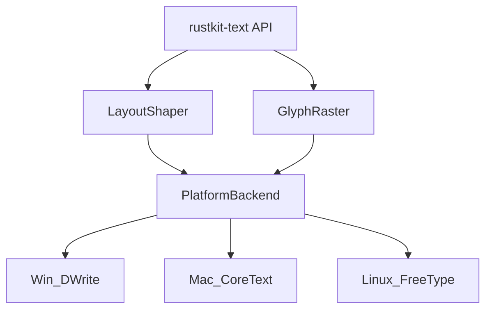
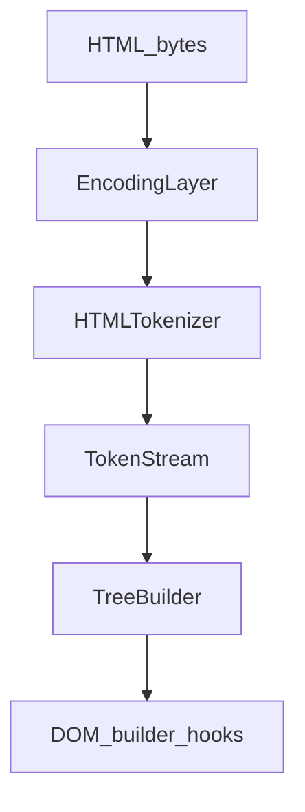
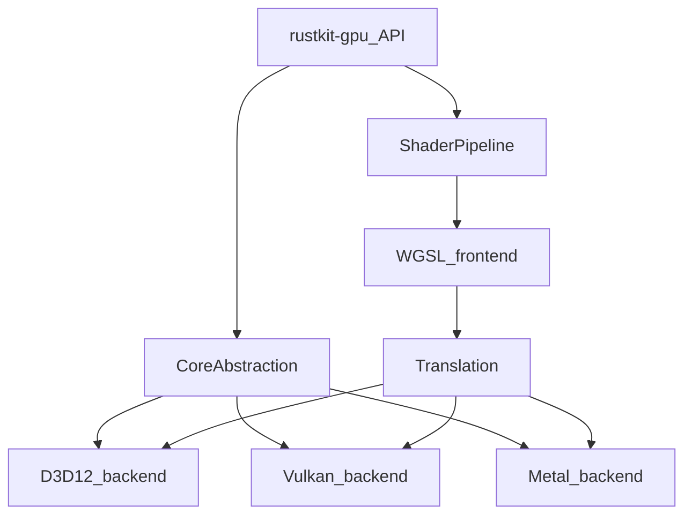

# Independence_Plan: Bravo Phases 1–6 (Detailed Implementation Plans)

## Scope and Constraints

- **Bravo phases** cover these replacements (boa_engine is explicitly out-of-scope for Bravo):
- **Bravo 1**: `cssparser` → `rustkit-cssparser`
- **Bravo 2**: `dwrote` → `rustkit-text`
- **Bravo 3**: `image` → `rustkit-codecs`
- **Bravo 4**: `reqwest` → `rustkit-http`
- **Bravo 5**: `html5ever` → `rustkit-html`
- **Bravo 6**: `wgpu` → `rustkit-gpu`
- **Third-party floor**: **Minimal OK**
- Allowed: small/spec-focused libraries or “unavoidable primitives” (e.g., TLS, DEFLATE) **if they don’t become the primary architecture**.
- Not allowed: reintroducing “the same thing in disguise” (e.g., swapping `reqwest` for another full HTTP client framework).

## Cross-cutting Strategy (applies to every Bravo phase)

### Dependency burn-down approach

1. **Introduce a RustKit-owned API** that matches exactly what the engine uses today.
2. **Implement a compatibility adapter** behind that API (initially calling the old dependency) so we can land the interface first.
3. **Replace the adapter** with a native implementation incrementally.
4. **Gate switching with a feature flag**, then remove the legacy dependency.

### Testing and acceptance

For each Bravo phase:

- **Unit tests** for core algorithms
- **Golden tests** (parser/tokenizer output, image decode output, etc.)
- **Integration tests** in the calling crate(s)
- **Canary** smoke tests (load pages, render, navigate)

---

## Bravo 1: Replace cssparser → `rustkit-cssparser`

### Where it’s used

- CSS parsing and computed styles in [`crates/rustkit-css`](crates/rustkit-css).

### Deliverable

- New crate: [`crates/rustkit-cssparser`](crates/rustkit-cssparser)
- Replace direct `cssparser` usage inside `rustkit-css`.

### Target API surface (owned)

- `Tokenizer` producing a token stream (iterator)
- `Parser` for:
- declarations: `property: value;`
- at-rules: `@media`, `@supports`, `@font-face`, `@keyframes`
- component values + functions (`calc()`, `var()`)
- selectors (either here or in `rustkit-selectors` if we split)

### Milestones

- **B1.0 Interface landing**
- Wrap current `cssparser` behind `rustkit-cssparser::Parser` so call sites stabilize.
- **B1.1 Tokenizer**
- CSS Syntax Level 3 tokenization: ident, function, at-keyword, hash, string, number, dimension, percentage, url, delim, whitespace, comment.
- Unicode escapes and error recovery.
- **B1.2 Value parsing**
- Build a minimal value AST that matches what `rustkit-css` currently expects.
- Implement parsing for properties already in RustKit (box model, flex, grid, animations, etc.).
- **B1.3 Selector parsing**
- Type, class, id, attribute selectors.
- Combinators, pseudo-classes/pseudo-elements subset you already support.
- Specificity calculation.
- **B1.4 Remove `cssparser`**

### Acceptance criteria

- All existing `rustkit-css` tests pass.
- Add “CSS parsing parity” golden tests on your supported property set.

### Risks

- Selector parsing complexity and error recovery; mitigate by scoping to selectors you currently match.

---

## Bravo 2: Replace dwrote → `rustkit-text`

### Where it’s used

- Text shaping/rasterization in:
- [`crates/rustkit-layout`](crates/rustkit-layout)
- [`crates/rustkit-renderer`](crates/rustkit-renderer)

### Deliverable

- New crate: [`crates/rustkit-text`](crates/rustkit-text)
- Replace `dwrote` usage with a **platform-backend abstraction**.

### Target architecture

### Target API surface (owned)

- `FontDatabase`: enumerate families, resolve fallback, load faces
- `TextShaper`: input text + style → glyph runs (glyph id, advances, offsets)
- `GlyphRasterizer`: glyph id + size → alpha bitmap (and optional subpixel)
- `FontFallback`: given codepoints, choose face chain

### Milestones

- **B2.0 Interface landing (adapter)**
- Implement `rustkit-text` API using dwrote internally (short-lived).
- **B2.1 Windows backend**
- Replace dwrote with direct COM bindings using the existing `windows` crate.
- Font collection, font face, glyph indices, metrics.
- **B2.2 Shaping**
- Minimum viable shaping path:
    - Latin shaping first (cluster mapping, advances)
    - Bidi support via UAX#9 (minimal implementation, or minimal dependency if needed)
- **B2.3 Rasterization + atlas integration**
- Produce consistent glyph bitmaps for `rustkit-renderer` glyph atlas.
- **B2.4 Cross-platform stubs**
- Implement buildable placeholders for CoreText and FreeType backends (can be “NotImplemented” on Windows builds), so the abstraction is correct.
- **B2.5 Remove `dwrote`**

### Acceptance criteria

- Existing text rendering tests remain stable.
- Visual parity test page set (golden screenshots) for:
- basic Latin text
- font fallback
- text decorations

### Risks

- Complex shaping (Indic/Arabic) and bidi. Mitigate: land platform backend and keep shaping minimal; expand coverage incrementally.

---

## Bravo 3: Replace image → `rustkit-codecs`

### Where it’s used

- Image decode in [`crates/rustkit-image`](crates/rustkit-image) and rendering pipeline.

### Deliverable

- New crate: [`crates/rustkit-codecs`](crates/rustkit-codecs)
- `rustkit-image` becomes a thin orchestrator over `rustkit-codecs`.

### Target API surface (owned)

- `detect_format(bytes) -> ImageFormat`
- `decode(bytes) -> DecodedImage` (RGBA8 + metadata)
- `decode_animation(bytes) -> Vec<Frame>`
- `encode_png(...)` (optional if needed for canvas exports)

### Supported formats (priority order)

1. PNG
2. JPEG
3. GIF (animated)
4. WebP
5. BMP/ICO (low complexity)

### Milestones

- **B3.0 Interface landing (adapter)**
- Wrap current `image` calls behind `rustkit-codecs` API.
- **B3.1 PNG decoder**
- Implement DEFLATE using a minimal dependency (acceptable per policy) or internal implementation.
- Filters, palettes, alpha.
- **B3.2 JPEG decoder**
- Baseline DCT first; progressive later.
- **B3.3 GIF decoder**
- LZW, disposal methods.
- **B3.4 WebP decoder**
- VP8 lossy path first; lossless later.
- **B3.5 Remove `image`**

### Acceptance criteria

- Deterministic decode output for a curated corpus (golden pixel hashes).
- Memory safety fuzzing on container formats.

### Risks

- Codec corner cases; mitigate with known corpora and fuzzing.

---

## Bravo 4: Replace reqwest → `rustkit-http`

### Where it’s used

- Networking in [`crates/rustkit-net`](crates/rustkit-net).

### Deliverable

- New crate: [`crates/rustkit-http`](crates/rustkit-http)
- `rustkit-net` uses `rustkit-http` for transport and keeps higher-level browser policy (cookies, CORS/CSP hooks, downloads).

### Scope (phased inside Bravo 4)

- Must-have for “browser correctness”:
- HTTPS via TLS
- redirects
- cookies integration hooks
- streaming bodies
- compression (gzip; brotli optional)
- Protocol support:
- **Stage 1**: HTTP/1.1 (complete)
- **Stage 2**: HTTP/2 (targeted)
- HTTP/3 explicitly out-of-scope for Bravo (future)

### Target API surface (owned)

- `HttpClient::send(request) -> Response`
- `RequestBuilder` (method, url, headers, body, timeout)
- `Response` (status, headers, body stream)
- `Interceptor` hooks (for RustKit security and download policies)

### Milestones

- **B4.0 Interface landing (adapter)**
- `rustkit-http` wrapping reqwest initially.
- **B4.1 TCP + TLS**
- Use a minimal TLS dependency (e.g., rustls) consistent with policy.
- Connection reuse and pooling.
- **B4.2 HTTP/1.1 codec**
- chunked transfer, keep-alive, content-length.
- **B4.3 Redirect + cookies hooks**
- Keep cookie storage in `rustkit-net` if desired; provide interface.
- **B4.4 HTTP/2**
- Prefer internal implementation; if too slow, allow a minimal protocol crate temporarily but keep your API stable.
- **B4.5 Remove `reqwest`**

### Acceptance criteria

- `rustkit-net` integration tests pass.
- Canary: page loads for common sites and internal test pages.
- Deterministic request interception and download behavior.

### Risks

- HTTP/2 is a major protocol; mitigate by landing HTTP/1.1 first and switching only once stable.

---

## Bravo 5: Replace html5ever → `rustkit-html`

### Where it’s used

- HTML parsing in [`crates/rustkit-dom`](crates/rustkit-dom).

### Deliverable

- New crate: [`crates/rustkit-html`](crates/rustkit-html)
- `rustkit-dom` consumes `rustkit-html` for document/fragment parse.

### Target architecture

### Target API surface (owned)

- `parse_document(bytes, url, options) -> Document`
- `parse_fragment(context_element, bytes) -> DocumentFragment`
- Streaming mode (optional but recommended): `Parser::push(bytes)`

### Milestones

- **B5.0 Interface landing (adapter)**
- Wrap html5ever behind `rustkit-html` API.
- **B5.1 Tokenizer**
- Implement the HTML5 tokenizer state machine (start with essential states).
- Character references.
- **B5.2 Tree builder**
- Insertion mode state machine.
- Open elements stack.
- Active formatting elements.
- **B5.3 Fragment parsing**
- innerHTML and template contexts.
- **B5.4 Error recovery + quirks mode**
- **B5.5 Remove `html5ever`**

### Acceptance criteria

- Parse parity for RustKit-supported pages.
- Add html5lib-tests as a gated suite; target 90%+ initially, 95%+ later.

### Risks

- Spec complexity (misnested tags, foster parenting). Mitigate by incremental insertion modes + corpus-driven development.

---

## Bravo 6: Replace wgpu → `rustkit-gpu`

### Where it’s used

- GPU device/surface/pipelines in:
- [`crates/rustkit-compositor`](crates/rustkit-compositor)
- [`crates/rustkit-renderer`](crates/rustkit-renderer)
- [`crates/rustkit-webgl`](crates/rustkit-webgl)
- [`crates/rustkit-canvas`](crates/rustkit-canvas)

### Deliverable

- New crate: [`crates/rustkit-gpu`](crates/rustkit-gpu)
- A **RustKit-owned GPU API** that is *wgpu-adjacent* enough to migrate without rewriting the renderer.
- Cross-platform requirement: **Vulkan + Metal + D3D12**.

### Key decision (recommended)

- **Do not recreate all of wgpu at once.** Build the minimal “engine GPU needs” subset first.

### Target architecture

### Minimal API surface (v1)

- Instance/Adapter/Device/Queue
- Surface/Swapchain
- Buffer/Texture/Sampler
- BindGroup/BindGroupLayout
- RenderPipeline
- CommandEncoder + RenderPass
- Required features for your renderer shaders (color + texture pipelines)

### Shader strategy (two-track)

- **Track A (fastest, recommended):** keep WGSL front-end via a minimal dependency (e.g., a translator) temporarily, but wgpu itself is gone.
- **Track B (pure):** implement a limited WGSL subset parser/compiler for the small shader set RustKit uses (color, texture, glyph).

### Milestones

- **B6.0 Interface landing (adapter)**
- Define `rustkit-gpu` traits/types that mirror what `rustkit-renderer` consumes.
- Implement adapter backend using wgpu (temporary) so call sites migrate first.
- **B6.1 D3D12 backend (Windows)**
- Swapchain, command lists, pipeline, resource binding.
- **B6.2 Vulkan backend**
- Swapchain, render pass, descriptors, pipelines.
- **B6.3 Metal backend**
- Command buffers, pipeline states, textures.
- **B6.4 Shader pipeline**
- Implement Track A first; Track B later.
- **B6.5 Migrate compositor + renderer**
- Remove `wgpu` from compositor and renderer crates.
- **B6.6 Stabilize + perf**
- GPU validation, resource lifetime tracking, capture/replay tooling.

### Acceptance criteria

- Renderer draws:
- solid rects
- borders
- images
- glyph atlas text
- Canary: multi-view, resize, scrolling pages, no GPU device lost.
- Cross-platform smoke (headless where needed).

### Risks

- This is a multi-quarter effort. Biggest risks:
- shader translation
- resource lifetime correctness
- backend divergence

---

## Deliverables (Docs) to create after plan approval

- [`docs/INDEPENDENCE/BRAVO-1-cssparser.md`](docs/INDEPENDENCE/BRAVO-1-cssparser.md)
- [`docs/INDEPENDENCE/BRAVO-2-dwrote.md`](docs/INDEPENDENCE/BRAVO-2-dwrote.md)
- [`docs/INDEPENDENCE/BRAVO-3-image.md`](docs/INDEPENDENCE/BRAVO-3-image.md)
- [`docs/INDEPENDENCE/BRAVO-4-reqwest.md`](docs/INDEPENDENCE/BRAVO-4-reqwest.md)
- [`docs/INDEPENDENCE/BRAVO-5-html5ever.md`](docs/INDEPENDENCE/BRAVO-5-html5ever.md)
- [`docs/INDEPENDENCE/BRAVO-6-wgpu.md`](docs/INDEPENDENCE/BRAVO-6-wgpu.md)

---

## Implementation Todos (Bravo 1–6)

- **bravo1-cssparser**: Land `rustkit-cssparser` API + adapter; migrate `rustkit-css`; remove `cssparser`.
- **bravo2-text**: Land `rustkit-text` API + adapter; implement Win backend; remove `dwrote`; add cross-platform backend stubs.
- **bravo3-codecs**: Land `rustkit-codecs` API + adapter; implement PNG/JPEG/GIF/WebP; remove `image`.