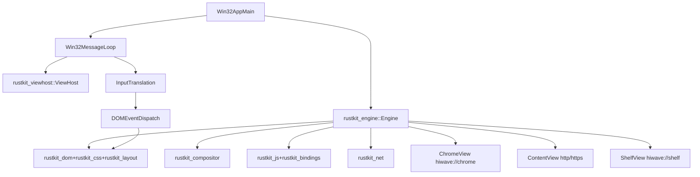

# Plan: Phases 14–18 (Windows-first, remove wry/tao)

## Goal

- **Windows-first**: make HiWave run without `wry`/`tao` by moving **Chrome UI + Content + Shelf** onto RustKit.
- Implement just enough of **Phases 14–18** to make the RustKit-rendered Chrome UI usable: click/keyboard, address bar input, basic images, flexbox-based layouts, and scrolling.

## High-level Architecture Change

- Replace the current `tao` event loop + `wry::WebView` Chrome/Shelf with a **Win32 host** + **RustKit views**.
- Keep `wry/tao` temporarily **only for non-Windows** (or as a fallback feature), then remove later.

## Phase 14: Event Handling (MVP for Chrome UI)

### Deliverables

- **Input plumbing (Win32 → RustKit)**
- Translate Win32 messages from `rustkit-viewhost` into RustKit input events: mouse move/down/up, wheel, key down/up, char input.
- **DOM event model (subset)**
- Implement capture/target/bubble for: `click`, `mousedown`, `mouseup`, `mousemove`, `wheel`, `keydown`, `keyup`, `input`, `focus`, `blur`.
- **Hit testing (layout → node)**
- Map pointer coordinates to the topmost DOM node using layout box geometry and stacking order.
- **Focus management**
- Track focused element per view; enable Tab key focus traversal (minimal).

### Likely code touchpoints

- `crates/rustkit-viewhost/src/lib.rs`: surface raw input messages/coordinates + DPI to engine.
- `crates/rustkit-engine/src/lib.rs`: per-view input routing, focus state.
- `crates/rustkit-bindings/src/lib.rs`: expose event dispatch hooks to JS, basic `addEventListener` wiring.
- `crates/rustkit-layout/src/lib.rs`: hit-test API against display list/layout tree.
- `crates/rustkit-dom/src/lib.rs`: node IDs, event target resolution.

### Acceptance criteria

- Chrome UI buttons/links respond to clicks.
- Hover and active states can be toggled via event dispatch (even if styling is basic).
- Keyboard shortcuts can be received by the focused view.

## Phase 15: Forms & Input (Address bar + minimal text fields)

### Deliverables

- Implement minimal `<input type="text">` and `<textarea>` behavior:
- caret position, text insertion/deletion, selection (minimal), clipboard optional.
- Dispatch `input` and `change` events.
- Map text editing to rendering (reuse Phase 13 text shaping).

### Likely code touchpoints

- `crates/rustkit-dom/src/lib.rs`: form element nodes, value storage.
- `crates/rustkit-bindings/src/lib.rs`: `HTMLInputElement.value`, `focus()`, `blur()`.
- `crates/rustkit-layout/src/lib.rs` + `crates/rustkit-layout/src/text.rs`: caret/selection painting commands.

### Acceptance criteria

- Address bar accepts text and backspace.
- Pressing Enter triggers navigation (wire to `rustkit-core` navigation).

## Phase 16: Images & Media (MVP)

### Deliverables

- Support `` rendering with:
- fetch image bytes through `rustkit-net`
- decode PNG/JPEG/WebP (initially)
- layout sizing using `width`/`height` attributes and CSS width/height.
- Basic caching keyed by URL.

### Likely code touchpoints

- `crates/rustkit-net/src/lib.rs`: fetch bytes + content-type.
- `crates/rustkit-layout/src/lib.rs`: add image layout boxes + display commands (bitmap draw).
- `crates/rustkit-compositor/src/lib.rs`: accept bitmap draw commands (or interim CPU blit path).

### Acceptance criteria

- Chrome UI icons (if moved to ``) render.
- Content pages with simple images render.

## Phase 17: CSS Flexbox (MVP for Chrome UI layout)

### Deliverables

- Implement enough flexbox for Chrome UI:
- row/column direction, nowrap, basic wrap optional
- `justify-content`, `align-items`, `gap`
- `flex-grow`, `flex-shrink`, `flex-basis`
- Map existing Chrome UI markup/layout patterns to flex.

### Likely code touchpoints

- `crates/rustkit-css/src/lib.rs`: parse needed flex properties (if missing).
- `crates/rustkit-layout/src/lib.rs`: flex formatting context.
- `crates/rustkit-test` + `tests/wpt/`: add flexbox-targeted tests.

### Acceptance criteria

- Chrome UI lays out correctly without wry/tao (tabs row, toolbar, sidebar).

## Phase 18: Scrolling & Overflow (MVP)

### Deliverables

- `overflow: auto/scroll/hidden` for block containers.
- Scroll offset state per scroll container.
- Mouse wheel scroll + scrollbars (optional; can start without visible bars).
- Expose minimal `scrollTop/scrollLeft` in bindings (optional in MVP).

### Likely code touchpoints

- `crates/rustkit-layout/src/lib.rs`: clip rects (already has PushClip/PopClip), scroll offsets.
- `crates/rustkit-engine/src/lib.rs`: per-view scroll input routing.
- `crates/rustkit-bindings/src/lib.rs`: `Element.scrollTop` stubs or minimal.

### Acceptance criteria

- Long pages scroll.
- Chrome UI tab strip / sidebar can scroll if content exceeds bounds.

## wry/tao Removal (Windows)

### Execution steps

- Introduce a Windows-only app entry that uses RustKit windowing:
- **Option A (recommended)**: create a new Windows bin (e.g. `crates/hiwave-win32`) that hosts the full app on RustKit.
- Keep existing `hiwave-app` + `wry/tao` for macOS/Linux initially.
- Gradually migrate:
- Render `hiwave://chrome` and `hiwave://shelf` through RustKit.
- Replace IPC glue that currently assumes WebView DOM.

### Files likely involved

- `crates/hiwave-app/src/main.rs` (or new `[crates/hiwave-win32/src/main.rs]`): select Win32 path.
- `crates/hiwave-app/src/webview.rs` and `crates/hiwave-app/src/webview_rustkit.rs`: pivot “chrome UI” and “shelf UI” to RustKit.
- `crates/rustkit-viewhost/` + `crates/rustkit-engine/`: host 3 views in a single top-level window.

## Verification & Canary

- Add/extend canary scenarios in `crates/hiwave-smoke`:
- click UI button
- type in address bar, press Enter
- scroll long content
- render image
- CI gates per phase:
- `cargo fmt --check`
- `cargo clippy --workspace -- -D warnings`
- `cargo test --workspace`
- targeted `rustkit-test` suites: `text`, `events`, `forms`, `flex`, `scroll`

## Risks / Constraints

- **Compositor**: if GPU bitmap blit isn’t ready, Phase 16 can start with a simplified raster path.