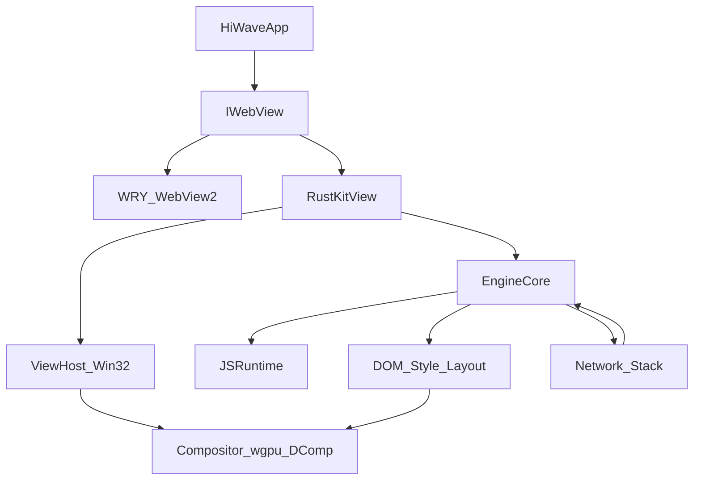
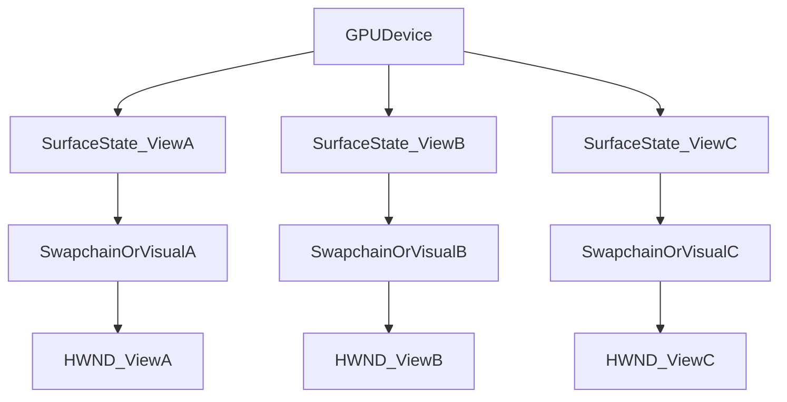

# Rust WebKit Rewrite for HiWave (MVP)

## Context and goals

- **Source of truth for current pain**: [`hiwave-windows/docs/WINCAIRO-LIMITATIONS.md`](P:\petes_code\ClaudeCode\hiwave-windows\docs\WINCAIRO-LIMITATIONS.md)
- **Integration seam in HiWave**: HiWave already abstracts the content engine behind `IWebView` in [`crates/hiwave-app/src/webview.rs`](P:\petes_code\ClaudeCode\hiwave-windows\crates\hiwave-app\src\webview.rs) and uses a **three-WebView architecture** (Chrome + Content + Shelf) where Content is the only piece that can be swapped (`wincairo` feature).

### Explicit MVP success criteria (measurable)

The Rust rewrite is considered MVP-complete when **all** are true:

- **Resize correctness**: Content view repaint always matches the latest bounds after any sidebar open/close/drag and after any main window resize.
- **Multiple concurrent views**: At least **3** simultaneous engine views can render concurrently (matching HiWave’s Chrome/Content/Shelf layout needs even if only Content uses the new engine initially).
- **Reliable lifecycle events**: Page start/commit/finish/fail and progress updates are emitted deterministically for main-frame navigations.
- **Navigation + request interception**: HiWave Shield can block at **network level** (not JS injection only), with per-request resource type classification.
- **Downloads**: Downloads are intercepted, saved to disk under HiWave control, and progress is surfaced to the UI.
- **Stability**: No crashes in a 1-hour scripted navigation stress run; deterministic shutdown.

### Non-goals for MVP (to keep the rewrite survivable)

- Full WebKit/Chromium parity
- Full Web Platform Tests (WPT) pass
- Advanced features: WebRTC, DRM/EME, GPU/WebGPU, full DevTools parity, full printing pipeline

## Strategy (what “fork WebKit and rewrite in Rust” means here)

You selected: **fork WebKit** + **rewrite core engine subsystems into Rust now**.To make that feasible for an MVP, the plan uses WebKit primarily as:

- **A specification-by-example**: LayoutTests + WPT subset + MiniBrowser behavior
- **A compatibility target**: we validate against WebKit’s observable behavior and test corpus
- **A regression harness**: we build “equivalent” tests for the WinCairo limitations

But the engine that HiWave embeds will be a **new Rust engine stack** (DOM/style/layout/paint/JS/network) that is *API-compatible with HiWave*, not necessarily ABI-compatible with `WebKit2.dll`.

## High-level architecture

### Embedder-facing API (HiWave)

- Add a new backend feature (example: `rustkit`) that implements `IWebView` alongside existing WRY/WebView2 and WinCairo WebKit.
- Keep Chrome/Shelf on WRY initially; migrate Content first.
- Preserve the same integration hooks HiWave already uses:
- `set_bounds` called frequently during sidebar drag + window resize (see `apply_layout` usage in [`crates/hiwave-app/src/main.rs`](P:\petes_code\ClaudeCode\hiwave-windows\crates\hiwave-app\src\main.rs))
- navigation decisions (currently via `set_navigation_handler` when using WinCairo)
- IPC bridge / script injection (currently via JS bridge)

### Engine process model

For MVP we can start in-process to reduce bring-up friction, but we must design for multi-process early.

- **Phase A (bring-up)**: in-process engine core + renderer threads
- **Phase B (hardening)**: split into separate processes:
- `BrowserProcess` (embedder-facing)
- `ContentProcess` (per-site-instance or per-tab)
- `NetworkProcess` (optional separation)
- `GPUProcess` (optional)

### Rendering/compositing (the key to solving the WinCairo blockers)

To solve **resize + multi-view** robustly:

- Use **per-view swapchain** (DXGI) or **DirectComposition visual** backed by a GPU texture.
- Own sizing at the compositor layer: on every bounds change, resize swapchain/target and re-render.
- Avoid global singletons for surfaces: every view has explicit `ViewId` → `SurfaceState`.

### Suggested Rust building blocks (accelerates the rewrite)

- **HTML parsing**: `html5ever`
- **CSS parsing**: `cssparser` + Servo selector machinery where practical
- **Layout + paint**: staged (block layout → flexbox → incremental layout); consider reusing Servo/Stylo pieces where possible
- **JS**: adopt a Rust JS engine as baseline (e.g., Boa) and invest in correctness/perf; keep an abstraction layer so the runtime can be swapped later if needed
- **Networking**: `hyper`/`reqwest`-like stack + `rustls`, cookie jar, cache, download manager
- **Text**: DirectWrite shaping or HarfBuzz via Rust bindings

## Data-flow diagrams

### Embedder to engine

### Multi-view resource ownership (fix “only most recent view renders”)

## Workstreams and phases

### Phase 0 — Product + engineering requirements (1–3 weeks)

- Define an **MVP compatibility matrix**:
- top sites you care about (e.g., GitHub, Wikipedia, news sites, OAuth flows)
- required APIs (cookies, localStorage, fetch, history, CORS)
- Define “done” for each limitation in [`docs/WINCAIRO-LIMITATIONS.md`](P:\petes_code\ClaudeCode\ClaudeCode\hiwave-windows\docs\WINCAIRO-LIMITATIONS.md) as automated tests.
- Decide initial constraints:
- **Windows-only** focus for MVP (recommended given current pain)
- security posture for MVP (sandbox on/off, feature gates)

### Phase 1 — Fork WebKit for reference + test harness (2–6 weeks)

- Create a maintained fork of WebKit (your `P:\WebKit` checkout can be the seed) with:
- pinned submodules/deps
- CI for Windows builds
- ability to run LayoutTests and/or WPT subset
- Extract minimal reproductions for:
- resize not repainting
- multi-view blanking
- missing loader/nav/download callbacks
- Add a small “HiWave-embedder harness” app that mimics:
- child HWND embedding
- `set_bounds` flood during sidebar drag
- view show/hide activation

### Phase 2 — New Rust engine skeleton (6–12 weeks)

Goal: display *something* reliably in a resizable HWND, with multiple views.

- Implement:
- `ViewHost_Win32`: creates child windows, handles `WM_SIZE`, DPI, focus, occlusion
- `Compositor`: draws a solid color + text + simple rectangles to prove resize + multi-view correctness
- `EngineCore` scaffolding: task queues, timers, event loop integration, navigation state machine
- Deliverables:
- multi-view demo app rendering distinct content in 3 resizable panes
- test that rapidly resizes 10,000 times without visual corruption

### Phase 3 — HTML → DOM → paint pipeline (3–6 months)

Goal: load simple HTML pages and render them.

- Implement:
- URL loading + basic HTTP (GET), response decoding, charset
- HTML parser → DOM tree
- CSS parser + cascade (minimal)
- layout: block flow + inline text (minimal)
- painting: backgrounds, borders, text
- Deliverables:
- render HiWave internal pages (about/new-tab/report/settings HTML in `crates/hiwave-app/src/ui/`)
- pass a curated subset of WebKit LayoutTests focused on HTML/CSS basics

### Phase 4 — JavaScript + DOM bindings (3–9 months, overlaps Phase 3)

Goal: enough JS to run common navigation + site scripts.

- JS runtime integration (Rust JS engine) with:
- event loop + microtasks
- Web APIs needed for basic sites: timers, console, basic DOM APIs, events
- DOM bindings:
- `document`, `window`, element APIs
- event dispatch, hit testing
- Deliverables:
- simple SPA navigation works (basic JS-driven DOM updates)
- deterministic page lifecycle events (start/commit/finish/fail)

### Phase 5 — Networking correctness + interception + downloads (2–6 months)

Goal: match HiWave needs (Shield + downloads) at network level.

- Networking:
- redirects, cookies, cache (minimal), HTTPS
- CORS (minimal), CSP (minimal)
- **Request interception**:
- request/response hooks with resource type classification
- integrate HiWave Shield rules (`crates/hiwave-shield`) at request start
- **Downloads**:
- stream-to-disk, progress, cancellation, filename resolution
- Deliverables:
- Shield blocks ads/trackers without JS injection
- downloads show up in HiWave download UI

### Phase 6 — Multi-view parity + windowing features (1–3 months)

- Tabs and multiple views on one GPU device
- New-window requests and popup policy
- Clipboard copy/paste reliability

### Phase 7 — Observability, tooling, and hardening (ongoing; 2–6 months for MVP-quality)

- Crash reporting, structured logs, GPU diagnostics
- Deterministic reftests (pixel tests) for resize regressions
- Security hardening plan:
- process isolation
- site-instance model
- permissions model

### Phase 8 — HiWave integration and rollout (1–2 months)

- Add `rustkit` backend to HiWave and ship behind a feature flag.
- Keep WebView2 fallback path for stability.
- Rollout strategy:
- nightly/dev builds first
- automatic fallback to WebView2 on crash

## How this directly resolves each listed limitation

- **View resize does not update rendered content**: compositor owns surfaces; `WM_SIZE` triggers swapchain/visual resize + re-render; add reftest that toggles sidebars while verifying pixel output.
- **Multiple concurrent WebViews not supported**: explicit per-view surface + scene graph; no “last created wins” global surface; stress test creates/destroys 100 views.
- **Page load events not implemented**: engine state machine emits start/commit/finish/fail; integration tests assert event ordering.
- **Navigation interception limited**: interception moves into the networking layer (request hook), with policy callbacks in the embedder.
- **Downloads not implemented**: dedicated download manager with progress + persistence.
- **Popups/new windows**: explicit “create-new-view” delegate with policy; defaults match HiWave’s popup filtering.
- **Clipboard**: direct Win32 clipboard integration with robust format negotiation.
- **DevTools**: MVP uses lightweight inspector (console + network log + DOM tree); full tooling is post-MVP.
- **Print**: post-MVP unless you require it for MVP; keep stub initially.

## Milestones and realistic staffing notes