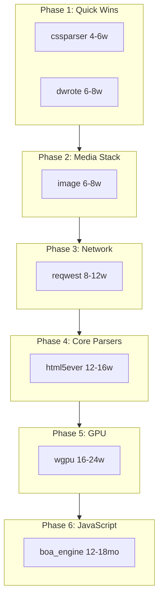
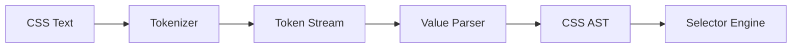
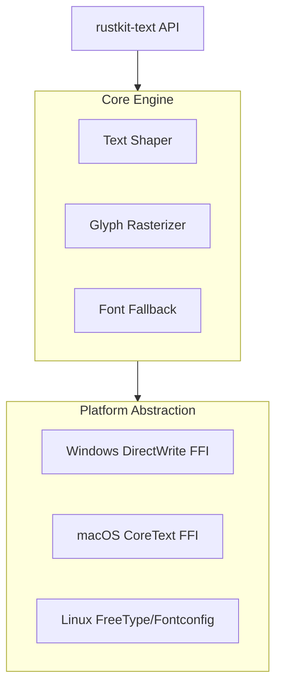
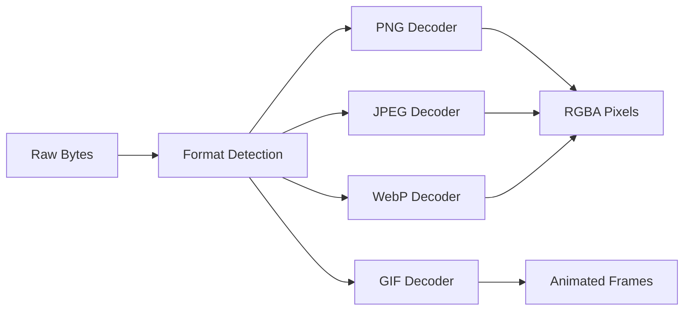
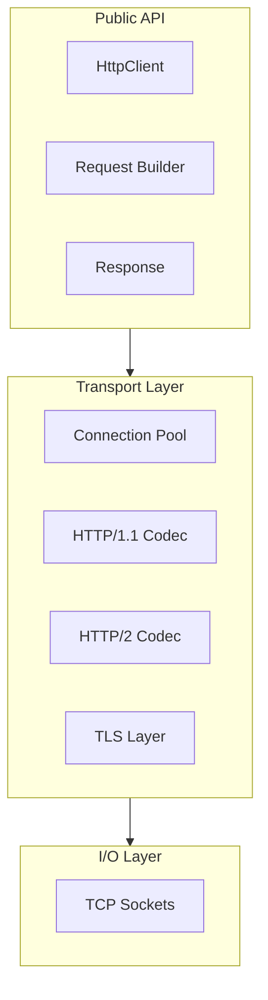
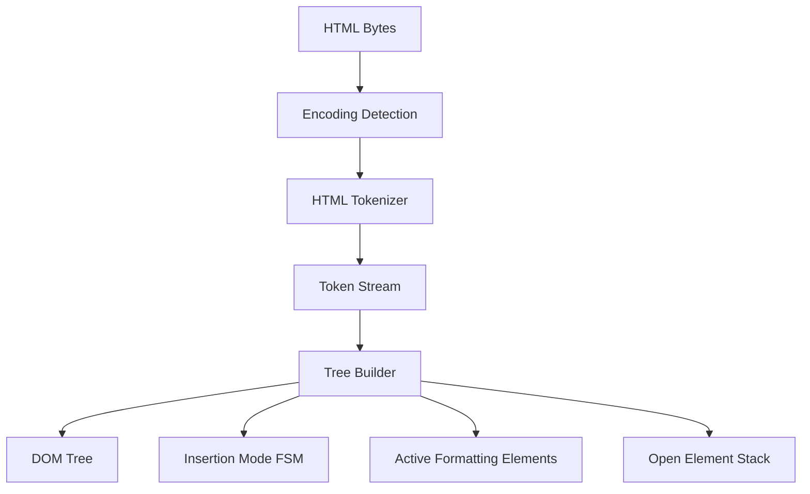
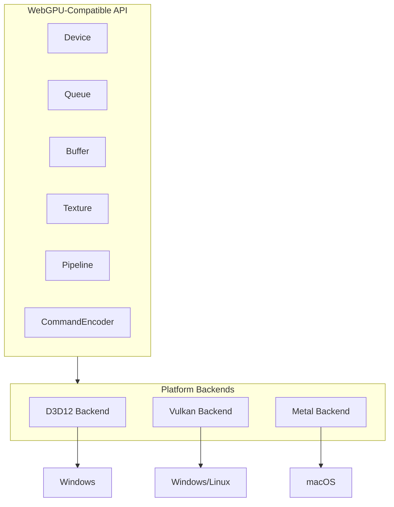
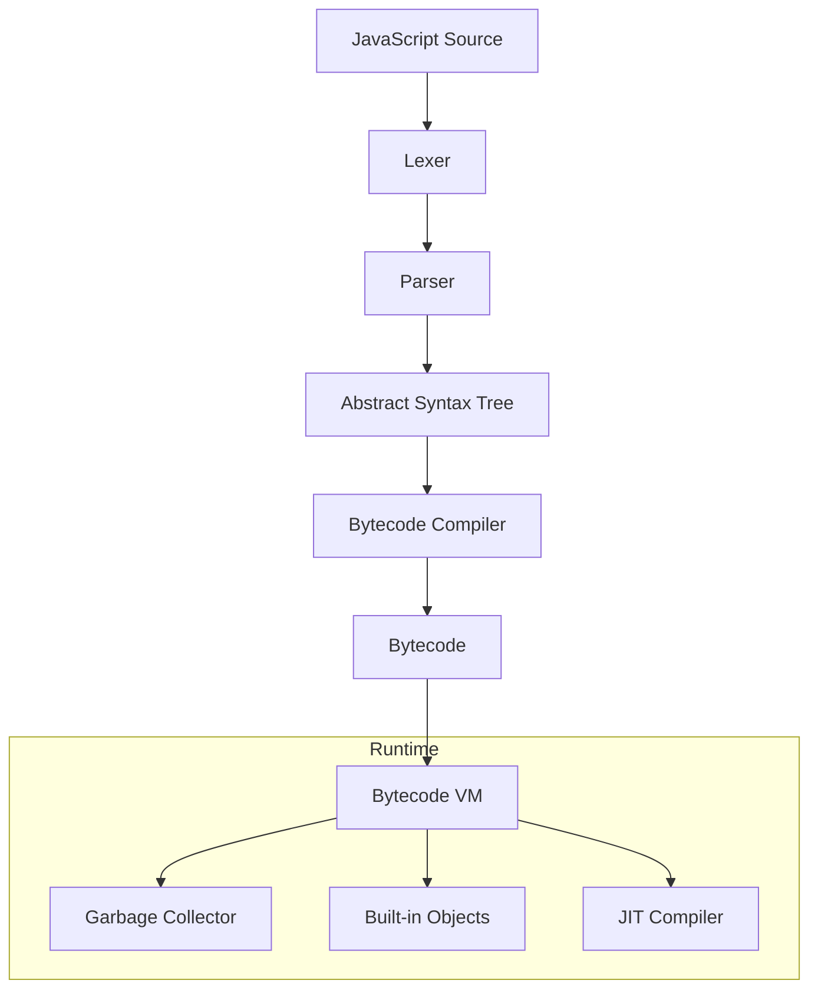

# RustKit Full Independence - Component Replacement Plans

## Executive Summary

Replace 7 major dependencies to achieve complete codebase independence:| Dependency | Replacement | Complexity | Est. Duration ||------------|-------------|------------|---------------|| cssparser | rustkit-cssparser | Medium | 4-6 weeks || dwrote | rustkit-text | Medium-High | 6-8 weeks || image | rustkit-codecs | Medium | 6-8 weeks || reqwest | rustkit-http | High | 8-12 weeks || html5ever | rustkit-html | Very High | 12-16 weeks || wgpu | rustkit-gpu | Very High | 16-24 weeks || boa_engine | rustkit-ecma | Extreme | 12-18 months |**Total Estimated Duration:** 2-3 years (phased)---

## Recommended Phase Order

---

## Plan 1: cssparser Replacement (rustkit-cssparser)

**Current Usage:** [crates/rustkit-css/Cargo.toml](crates/rustkit-css/Cargo.toml)

### Scope

- CSS tokenizer (CSS Syntax Level 3)
- CSS value parser
- Selector parser
- @-rule parsing
- Error recovery

### Architecture

### Implementation Steps

1. **Tokenizer** (2 weeks)

- Implement CSS tokenization per spec
- Handle comments, strings, numbers, identifiers, functions
- Unicode escape sequences

2. **Value Parser** (2 weeks)

- Parse component values
- Handle functions, blocks, calc()
- Custom property parsing

3. **Selector Parser** (1 week)

- Compound selectors, combinators
- Pseudo-classes, pseudo-elements
- Specificity calculation

4. **Integration** (1 week)

- Replace cssparser in rustkit-css
- Migrate existing code

### Dependencies

- None (pure Rust)

### Testing Strategy

- CSS Working Group test suite
- Fuzz testing with arbitrary CSS

---

## Plan 2: dwrote Replacement (rustkit-text)

**Current Usage:** [crates/rustkit-layout/Cargo.toml](crates/rustkit-layout/Cargo.toml), [crates/rustkit-renderer/Cargo.toml](crates/rustkit-renderer/Cargo.toml)

### Scope

- Font enumeration and loading
- Text shaping (Unicode Script, BiDi)
- Glyph rasterization
- Font fallback

### Architecture

### Implementation Steps

1. **DirectWrite FFI** (2 weeks)

- Direct Win32 bindings (replace dwrote)
- Font collection enumeration
- Font face creation

2. **Text Shaper** (2 weeks)

- Script detection
- Bidi algorithm (Unicode UAX #9)
- Shaping via platform API

3. **Glyph Rasterization** (2 weeks)

- Glyph outline extraction
- Rasterization to bitmap
- Subpixel rendering

4. **Font Fallback** (1 week)

- System font fallback chain
- Unicode coverage mapping

5. **Cross-Platform** (1 week)

- CoreText backend (macOS)
- FreeType backend (Linux)

### Dependencies

- windows crate (for FFI, already used)

---

## Plan 3: image Replacement (rustkit-codecs)

**Current Usage:** [crates/rustkit-image/Cargo.toml](crates/rustkit-image/Cargo.toml)

### Scope

- PNG decoder/encoder
- JPEG decoder
- GIF decoder (animated)
- WebP decoder
- BMP, ICO decoders
- Image resizing

### Architecture

### Implementation Steps

1. **PNG Decoder** (2 weeks)

- DEFLATE decompression
- Filter reconstruction
- Color type handling
- Interlacing

2. **JPEG Decoder** (2 weeks)

- Huffman decoding
- DCT transform
- Color space conversion
- Progressive JPEG

3. **GIF Decoder** (1 week)

- LZW decompression
- Frame disposal
- Animation timing

4. **WebP Decoder** (2 weeks)

- VP8 lossy decoding
- VP8L lossless decoding
- Animation support

5. **Utilities** (1 week)

- Format detection
- Image resizing (bilinear, bicubic)
- Color conversion

### Dependencies

- miniz_oxide for DEFLATE (or custom implementation)

---

## Plan 4: reqwest Replacement (rustkit-http)

**Current Usage:** [crates/rustkit-net/Cargo.toml](crates/rustkit-net/Cargo.toml)

### Scope

- HTTP/1.1 client
- HTTP/2 client
- TLS (via native-tls or rustls)
- Connection pooling
- Cookie handling
- Redirect following
- Compression (gzip, brotli)

### Architecture

### Implementation Steps

1. **TCP/TLS Layer** (2 weeks)

- Async TCP with tokio
- TLS via rustls (keep dependency) or native-tls
- Connection management

2. **HTTP/1.1 Codec** (2 weeks)

- Request serialization
- Response parsing (chunked, content-length)
- Keep-alive

3. **HTTP/2 Codec** (3 weeks)

- Frame parsing
- HPACK header compression
- Stream multiplexing
- Flow control

4. **Connection Pool** (1 week)

- Connection reuse
- Idle timeout
- Per-host limits

5. **Client API** (2 weeks)

- Request builder
- Cookie jar integration
- Redirect handling
- Decompression
- Timeouts

### Dependencies

- rustls or native-tls (TLS is complex enough to keep)
- tokio (async runtime)

---

## Plan 5: html5ever Replacement (rustkit-html)

**Current Usage:** [crates/rustkit-dom/Cargo.toml](crates/rustkit-dom/Cargo.toml)

### Scope

- HTML5 tokenizer
- HTML5 tree builder
- Error recovery (quirks mode)
- Fragment parsing
- Template handling

### Architecture

### Implementation Steps

1. **Tokenizer** (3 weeks)

- State machine (80+ states)
- Character reference decoding
- Attribute handling
- DOCTYPE parsing
- Script data states

2. **Tree Builder** (4 weeks)

- Insertion modes (20+)
- Active formatting elements
- Foster parenting
- Template handling
- Implicit tag closing

3. **Error Recovery** (2 weeks)

- Quirks mode detection
- Parse error handling
- AAA algorithm
- Misnested tags

4. **Fragment Parsing** (1 week)

- innerHTML parsing
- Context element handling

5. **Integration** (2 weeks)

- Replace html5ever in rustkit-dom
- Streaming parsing support
- Performance optimization

### Dependencies

- encoding_rs for character encoding (or custom)

### Testing Strategy

- html5lib-tests suite (16,000+ tests)

---

## Plan 6: wgpu Replacement (rustkit-gpu)

**Current Usage:** [crates/rustkit-compositor/Cargo.toml](crates/rustkit-compositor/Cargo.toml), [crates/rustkit-renderer/Cargo.toml](crates/rustkit-renderer/Cargo.toml), [crates/rustkit-canvas/Cargo.toml](crates/rustkit-canvas/Cargo.toml), [crates/rustkit-webgl/Cargo.toml](crates/rustkit-webgl/Cargo.toml)

### Scope

- D3D12 backend (Windows)
- Vulkan backend (cross-platform)
- Metal backend (macOS)
- Shader compilation
- Resource management
- Command encoding

### Architecture

### Implementation Steps

1. **D3D12 Backend** (6 weeks)

- Device creation
- Command list encoding
- Resource binding
- Render pipeline
- Compute pipeline

2. **Vulkan Backend** (6 weeks)

- Instance/device creation
- Swapchain management
- Command buffer
- Descriptor sets
- Pipeline layout

3. **Metal Backend** (4 weeks)

- Device/queue
- Command encoding
- Pipeline state
- Resource management

4. **Shader Compiler** (4 weeks)

- WGSL parser
- SPIR-V to DXIL (D3D12)
- SPIR-V to MSL (Metal)
- Or: naga integration

5. **Resource Management** (2 weeks)

- Memory allocation
- Buffer/texture creation
- Bind group management

6. **WebGPU API Layer** (2 weeks)

- wgpu-compatible API surface
- Drop-in replacement

### Dependencies

- ash (Vulkan bindings) or raw bindings
- windows crate (D3D12)
- metal-rs (Metal) or raw bindings

### Alternative

Consider keeping wgpu but contributing upstream fixes. Full replacement is 4-6 months of dedicated work.---

## Plan 7: boa_engine Replacement (rustkit-ecma)

**Current Usage:** [crates/rustkit-js/Cargo.toml](crates/rustkit-js/Cargo.toml)

### Scope

- ECMAScript 2024 full compliance
- Lexer and parser
- Bytecode compiler
- Virtual machine
- Garbage collector
- Built-in objects
- JIT compilation (for performance)

### Architecture

### Implementation Steps (18 months)

**Year 1: Core Engine**

1. **Lexer** (2 weeks)

- Token types
- Unicode identifiers
- Numeric literals
- Template literals
- Automatic semicolon insertion

2. **Parser** (6 weeks)

- Expression parsing (Pratt parser)
- Statement parsing
- Destructuring
- Classes
- Modules
- Async/await

3. **AST and Scope Analysis** (2 weeks)

- AST nodes
- Scope chain
- Variable hoisting
- TDZ detection

4. **Bytecode Compiler** (6 weeks)

- Instruction set design
- Expression compilation
- Control flow
- Exception handling
- Closures

5. **Virtual Machine** (8 weeks)

- Stack-based VM
- Instruction dispatch
- Call stack
- Exception handling
- Tail call optimization

6. **Garbage Collector** (4 weeks)

- Mark-and-sweep baseline
- Generational GC
- Weak references
- FinalizationRegistry

7. **Built-in Objects (Part 1)** (8 weeks)

- Object, Function, Array
- String, Number, Boolean
- RegExp
- Date
- Math
- JSON

**Year 2: Completeness and Performance**

8. **Built-in Objects (Part 2)** (8 weeks)

- Map, Set, WeakMap, WeakSet
- Promise
- Symbol
- Proxy, Reflect
- TypedArrays, ArrayBuffer, DataView
- Intl (internationalization)

9. **Async Runtime** (4 weeks)

- Event loop integration
- Promise job queue
- Async iteration

10. **Module System** (4 weeks)

    - ES modules
    - Dynamic import()
    - Import maps
    - Module caching

11. **JIT Compiler** (12-16 weeks)

    - Baseline JIT (method compilation)
    - Type inference
    - Inline caching
    - Deoptimization

12. **Optimization** (8 weeks)

    - Hidden classes
    - Inline caching
    - String interning
    - Fast paths

### Dependencies

- icu4x for Unicode and Intl
- regex crate or custom RegExp engine

### Testing Strategy

- Test262 (ECMAScript conformance suite)
- Target: 90%+ pass rate for full compliance

### Alternative Approaches

1. **Fork Boa**: Maintain internal fork with HiWave-specific optimizations
2. **V8 Bindings**: Use V8 via rusty_v8 (complex but proven)
3. **QuickJS Port**: Port QuickJS to Rust (smaller, simpler)
4. **Subset JS**: Implement ES6 core only (faster, less compatible)

---

## Recommended Implementation Order

### Phase 1 (Months 1-3)

- **cssparser** replacement - Clean win, well-defined spec
- **dwrote** replacement - Platform abstraction needed anyway

### Phase 2 (Months 4-6)

- **image** replacement - Independent, testable

### Phase 3 (Months 7-9)

- **reqwest** replacement - Networking independence

### Phase 4 (Months 10-13)

- **html5ever** replacement - Core parser independence

### Phase 5 (Months 14-18)

- **wgpu** replacement - GPU independence

### Phase 6 (Months 19-36)

- **boa_engine** replacement - JavaScript independence

---

## Risk Mitigation

1. **Parallel Development**: Each plan can proceed independently
2. **Incremental Migration**: Replace one dependency at a time
3. **Compatibility Shims**: Keep old API surface during transition
4. **Test Suites**: Use existing conformance tests (html5lib, test262, CSS WG)
5. **Fallback**: Maintain ability to switch back to original dependency

---

## Success Criteria

| Dependency | Success Metric ||------------|----------------|| cssparser | Parse CSS3 per spec, pass WG tests || dwrote | Text renders correctly on Windows/Mac/Linux || image | Decode PNG/JPEG/GIF/WebP without external libs || reqwest | HTTP/1.1 + HTTP/2, pass integration tests || html5ever | Pass html5lib-tests suite (95%+) |